* Computer vison is the process of automatically analyze images and videos to understand them, understand the story of data (image, video).
* CV is primarily intended to duplicate human visoin, but because of the complexity and lack of understanding human vision, there is a still room for improvement
* Human eye
  * 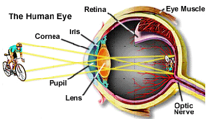
  * when we look at object, light from the object reflect into retina, which has **cones** and **rods** (**receptors**). Cones and rods convert light into 
    * **Cones**
      * 6-7 million
      * located near the center of retina (the fovea)
      * sensetive to color
      * can resolve fine details because each is attached to a single **nerve ending**
      * cone vision is called **photopic** or **bright-light vision**
    * **Rods**
      * 75-150 million distributed over the retinal surface
      * multiple rods connected to a single **nerve ending**
      * give a general overall picture of the field of illumination
      * not color sensitive but are sensitive to low levels of illumination
      * Rod vision is called **scotopic** or **dim-light vision**
    * 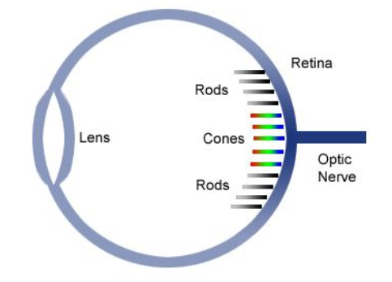
    * around the optic nerve there are no **receptors**, thus creating a **blind spot**
    * 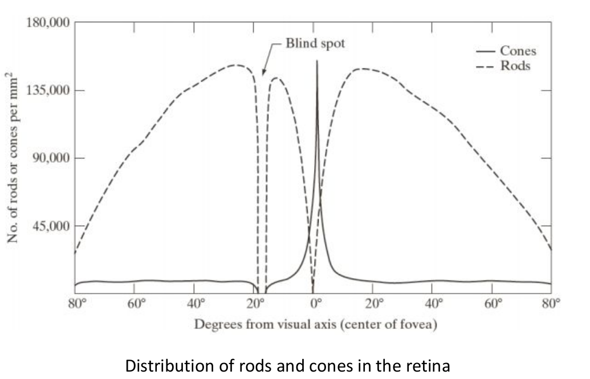
    * [blind sport experiment](https://www.aao.org/museum-eye-openers/experiment-blind-spot)
    * 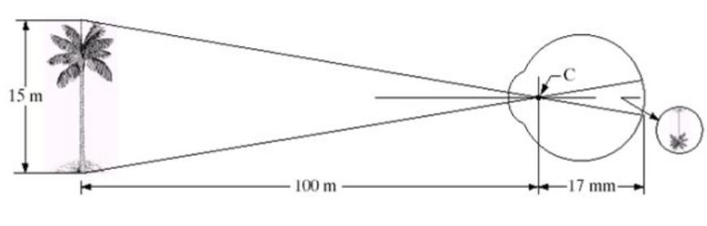
    * 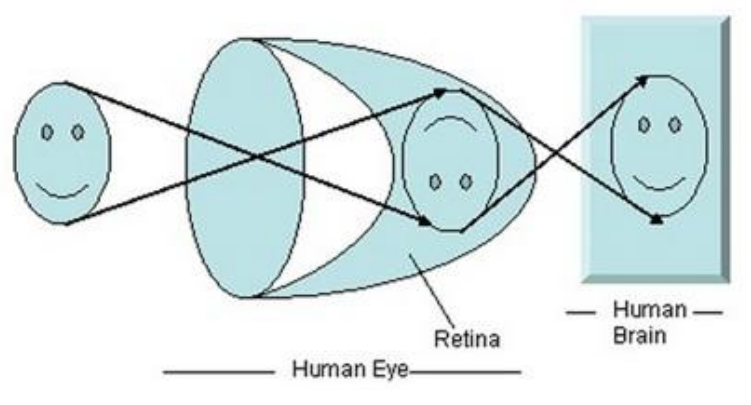
* ### Image formation
  * #### Camera
    * [how does the camera work?](https://www.youtube.com/watch?v=B7Dopv6kzJA)
    * [better video](https://www.youtube.com/watch?v=gWB2aAAMBnY)
    * 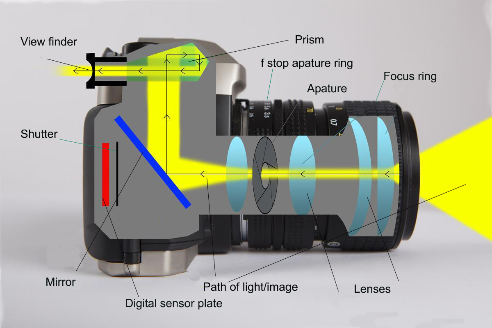
    * A camera functions through a series of steps involving several key components and processes:
      * **Lens**: The lens is a curved piece of glass or plastic that gathers light from the scene and focuses it onto the image sensor or film. Lenses can be adjusted (focused) to sharpen the image based on the distance of the subject.
      * **Aperture**: This is an adjustable opening within the lens that controls the amount of light entering the camera. The aperture size is measured in f-stops (e.g., f/2.8, f/16). A wider aperture (lower f-stop number) allows more light in, while a narrower aperture (higher f-stop number) allows less light in.
      * **Shutter**: The shutter is a mechanical or electronic device that opens and closes to control the duration that light hits the sensor or film. The time it stays open is called the shutter speed. A fast shutter speed (e.g., 1/1000s) captures quick motion, while a slow shutter speed (e.g., 1/30s) allows more light for low-light conditions but can cause motion blur.
      * **Image Sensor (Digital)**: In digital cameras, the image sensor (usually a CCD or CMOS sensor) converts the focused light into electrical signals, which are then processed into a digital image. The sensor's resolution is measured in megapixels, which determines the detail of the image.
      * **Film** (**Analog**): In film cameras, the light is captured on a strip of chemically treated film. When exposed to light, the chemicals react to create a latent image that is later developed into a visible photograph.
      * **Viewfinder**/**Live** **View**: The viewfinder is the part of the camera through which the photographer composes the shot. In digital cameras, a live view mode on the LCD screen allows for composition and real-time preview of the image.
      * **Image Processing**: In digital cameras, once the image is captured, it's processed by the camera’s processor, where adjustments to color, contrast, sharpness, and other parameters can be made.
      * **Storage**: The final image is saved to a memory card (in digital cameras) or remains on the film (in analog cameras) until developed.
  * Images are generated by the combination of
    * an **illumination** source and
    * the **reflection** or **absorption of energy** from that **source** by the elements of the **scene** being imaged.
    * 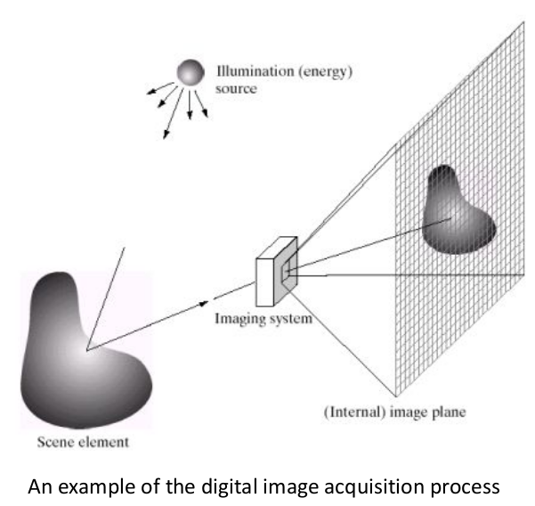
    * Digital image is the discrete representation of reflection function. It is aquired by sampling and quantizing reflection function
    * **Reflectance Function**:
      * The **reflectance function** describes how surfaces in a scene reflect light. It's a continuous function that varies across the scene, capturing the intensity and color of light reflected from every point.
    * **Digital Image**:
      * A digital image is a discrete representation of this continuous **reflectance function**. It’s formed by:
      * **Sampling**: Measuring the reflectance at discrete points in the scene, corresponding to pixels in the image.
      * **Quantization**: Mapping the continuous range of reflectance values to a finite set of digital values (e.g., 0-255 for each color channel in an 8-bit image).
      * **8-bit image** is a type of digital image where each pixel is represented by 8 bits of data, which means each pixel can take value in range of 0-255.
      * in **Gray-scale** image, each pixel can take 256 (2^8) possible intensity levels of gray
        * 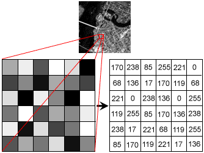
      * **RGB 8-bit per channel** image's pixel has 3 channels. Each channel is represented by 256 values of red, green or blue. By compining each channel we can create a color. So, 1 pixel in **RGB** can have one of the 16.7 million (= 256 x 256 x 256) colors.
        * 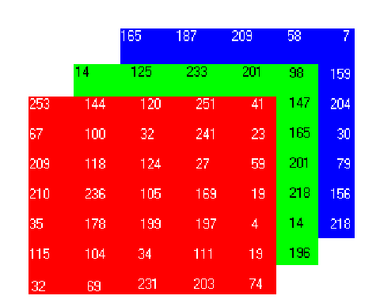
    * As said earlier to digitize image we need **sampling** and **quantization** of reflection funciton:
      * #### Sampling
        * 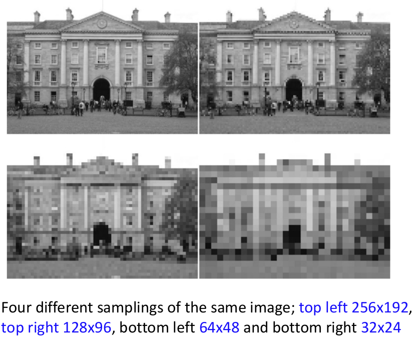
        * **sampling** is the process selecting a subset of points from **reflection function**.
        * Here’s a simplified explanation of each image:
          * 256x192:
            * total of 256x192 = 49152 points, which means 49152 points were chosen from **reflection function**
          * 128x96:
            * 128x96 = 12288 points, which means 49152 points were chosen from **reflection function**
            * ...
          * So, the more sample points we have, the higher size and detailed image we have.
          * **Sampling** affects the size (resolution)
      * #### Quantization
        * is the process of mapping a continuous range of values (like light intensities), AKA points sampled from reflection function, to a limited set of discrete values.
        * Each quantized integer value is known as a **pixel**, is the smallest discrete accessible sub-section of a digital image
        * 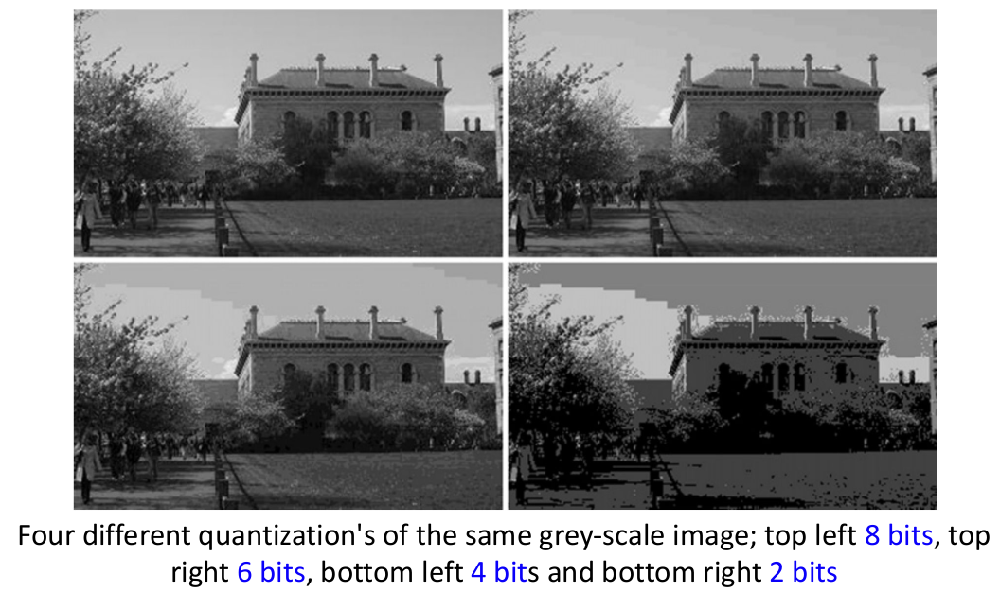
        * **8 bit** quantized image means that a sampled pont from reflection function will be mapped into one of the values in range of 0-255.
        * **6 bit** quantized image means that a sampled pont from reflection function will be mapped into one of the values in range of 0-63.
        * **4 bit** quantized image means that a sampled pont from reflection function will be mapped into one of the values in range of 0-31.
        * **2 bit** quantized image means that a sampled pont from reflection function will be mapped into one of the values in range of 0-3.
        * So, the larger size we have the more colors we can camputure. Also a we will get a smoother image  
    #### Sampling Theory
    * [frequency, period related refresh](week_01_01.md)

- [A Standardized Approach for Skin Detection: Analysis of the Literature and Case Studies](https://www.notion.so/lecture-1-d545272ec7514ba1a59cd09edbe33d70?pvs=21)
- [Human skin detection: An unsupervised machine learning way](https://www.sciencedirect.com/science/article/pii/S1047320324000014#baep-article-footnote-id1)
- [Skin Detection - a Short Tutorial](https://people.cs.rutgers.edu/~elgammal/pub/skin.pdf)
- [Skin detection Tutorial Medium](https://medium.com/@madadihosyn99/skin-detection-using-hls-color-space-b73114de076b)
  
- Sampling and Quantization
    - https://wimarshikathamali1995.medium.com/sampling-quantization-in-digital-image-processing-8c4490357039
    - https://dev.to/haratena9/memorandum-image-processing-1-pixels-quantization-and-sampling-1n02
    
    ### 1. **Sampling:**
    
    - **Definition**: Sampling refers to the process of converting a continuous image (analog) into a discrete image (digital) by measuring the image's intensity at regular intervals.
    - **How it works**: An image can be thought of as a continuous signal in two dimensions (x and y coordinates). To digitize it, the image is sampled at specific points, usually arranged in a grid. Each sample represents a pixel in the digital image.
    - **Impact**: The spacing of these samples determines the resolution of the image. Higher sampling rates (more pixels per unit area) result in higher resolution images with more detail, while lower sampling rates result in lower resolution images with less detail.
    
    ### 2. **Quantization:**
    
    - **Definition**: Quantization refers to the process of mapping a large set of continuous amplitude values (intensity or color values) to a smaller set of discrete values.
    - **How it works**: Once an image is sampled, each sample (pixel) has an intensity value, often representing the color or brightness. Since digital systems can only store a finite number of values, these continuous values must be rounded off to the nearest available value in a predefined set. This set could be, for instance, 256 levels of gray in an 8-bit grayscale image.
    - **Impact**: The number of discrete levels available is determined by the bit depth of the image. A higher bit depth allows for more levels and more accurate representation of the original image. Lower bit depth results in more noticeable quantization errors, such as banding in gradients.
    
    ### Example in Practice:
    
    - Consider an analog grayscale image. When you sample it, you decide on a grid (like 100x100 pixels), and measure the brightness at each of those grid points. That’s sampling.
    - Then, for each measured brightness (which could theoretically have any value within a range), you assign it to one of 256 possible values (if you’re using 8-bit quantization). This rounding-off process is quantization.
    
    ### Importance in Computer Vision:
    
    - **Sampling** affects the spatial resolution of an image, which is crucial for tasks like object detection, where fine details might be important.
    - **Quantization** affects the color or intensity resolution, impacting how accurately the visual content is represented. It can also affect the performance of algorithms, particularly in tasks that rely on subtle color or intensity variations.
    - Skin detection
    - bitwise operations in CV