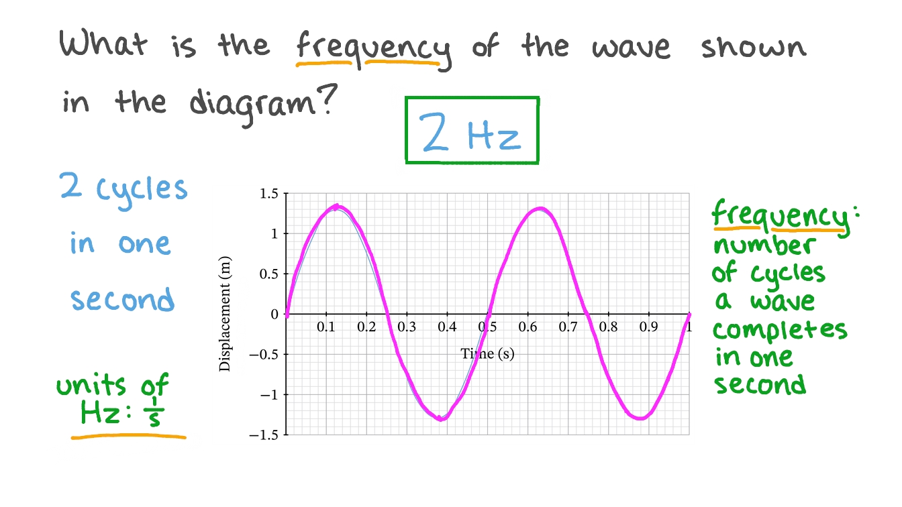
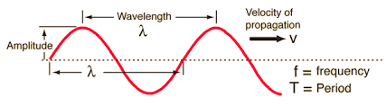
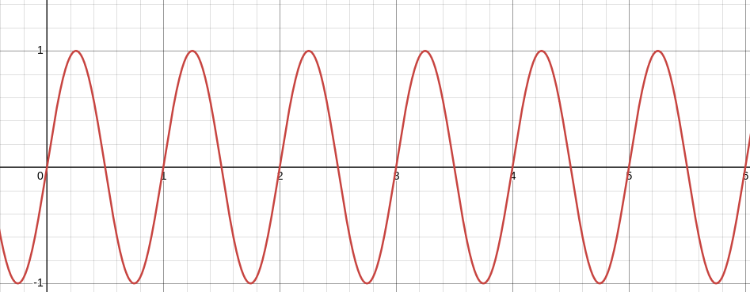
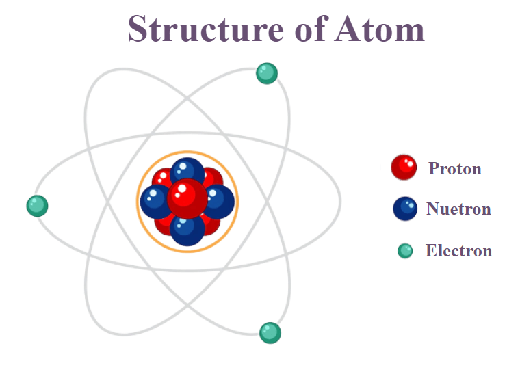
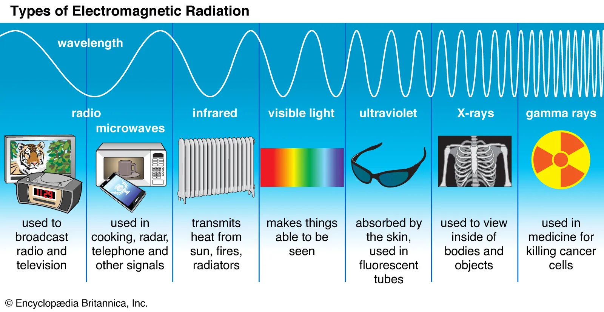

### Frequency of a function
* Refers to how often a particular pattern or cycle repeats itself over a specific period of time.
    
* Consider a sinusoidal function, such as `f(t) = sin(2*pi*t)`, which represents a simple wave. The frequency of this wave indicates how many complete cycles it goes through in 1 second.
    

### Period related
* The **period** of a function refers to the length of time or the interval over which the function repeats itself. In other words, it's the duration required for one complete cycle of the function.
* If a function $f(t)$ has a period $T$, this means: $$f(t+T)=f(t)$$
* Consider the sine function $f(t)=sin(2πt)$. The period $T$ of this function is 1 second. This is because the sine wave completes one full cycle (from 0 to 1, back to 0, to -1, and back to 0) in 1 second.
    
### Finding period and frequency of a function
* Start with the general form $f(t)=sin(ωt)$, where $ω$ is the angular frequency.
* The period $T$ is given by: $$T = \frac{2 \pi}{w}$$
* The frequency $f$ is the reciprocal of the period: $$f = \frac{1}{T}$$

### What is an **Atom**?
* An **atom** is the basic unit of matter that defines the chemical elements. It is the smallest particle of an element that retains the chemical properties of that element. Everything around us—solids, liquids, and gases—is made up of **atom**s.

* Structure of an **Atom**
* 
  * **Nucleus**:
    * Location: At the center of the **atom**.
    * Components: Composed of **protons** and **neutrons**.
      * **Protons**: Positively charged particles.
      * **Neutrons**: Neutral particles with no charge.
  * Function: The nucleus contains most of the **atom**'s mass and has a positive charge because of the **protons**.
  * **Electron Cloud**:
    * Location: Surrounds the nucleus in various regions called orbitals or **energy levels**.
    * Components: **Electrons**.
    * **Electrons**: Negatively charged particles.
    * Function: **Electrons** move around the nucleus and are involved in chemical bonding and reactions.
### What is an Electron?
* An **electron** is a fundamental particle within an **atom**. **Electrons** carry a **negative** electric charge. The magnitude of this charge is equal and opposite to the positive charge of a proton. They have a much smaller mass compared to **protons** and **neutrons**. Their mass is about 1/1836th of that of a proton. **Electrons** are found in regions around the nucleus known as orbitals or **energy levels**. These are not fixed paths but probabilistic areas where **electrons** are likely to be found. **Electrons** don’t follow classical paths but occupy orbitals defined by quantum mechanics. Their exact position is uncertain, but their probable location can be described by probability clouds. **Electrons** occupy different **energy levels**. They can move between these levels by absorbing or emitting energy.

### Electromagnetic Radiation
* is typically produced when any charged particle (not just electrons) is **accelerated**. However, **electrons** are the most common source because they are relatively light, easy to move, and are abundant in atoms.
*  There are diiferent radiations as a result of particle's **acceleration**. The specific type of radiation—whether it's radio waves, microwaves, visible light, or gamma rays—depends on the nature of the particle's motion and the energy involved.

* When **electrons** in an **atom** absorb or release energy, they can jump between different **energy levels**. When they fall from a higher **energy level** to a lower one, they emit energy in the form of **electromagnetic radiation** (such as visible light, x-ray, ultraviolate ...).

### What is electron acceleration?
Here's a more detailed look at what it means for electrons to accelerate:

1. **Electron Transition Between Energy Levels**
   * **Energy Level** Transitions: In an atom, electrons can absorb or emit energy, which causes them to jump between different **energy level**s or **orbitals**. This is a discrete process, meaning the electron moves from one specific **energy level** to another.

   * Absorption: An electron absorbs energy (e.g., from a photon) and moves to a higher **energy level**.
   * Emission: An electron releases energy (e.g., as light) and falls to a lower **energy level**.
   * Not Acceleration: While this transition involves a change in energy, it is not considered acceleration in the classical sense. It's more about a quantum leap from one energy state to another.
   * Resulting Radiation:
      * **Visible Light**: Electrons in atoms emit visible light when they fall from a higher energy level to a lower one.
      * **Ultraviolet (UV) Radiation**: If the energy gap is larger, UV light is emitted.
      * **Infrared Radiation**: If the energy gap is smaller, infrared light is emitted.
      * **Typical Contexts**: This occurs in atoms and molecules, particularly in gases or when materials are heated (like in stars).
        * **Energy gap** refers to the difference in energy between two distinct **energy levels**. The size of this gap determines the wavelength (and thus the color) of the light emitted or absorbed.

         * Example: In a hydrogen atom, if an electron drops from the second energy level to the first, it emits a photon with a specific energy, corresponding to a certain wavelength of light.

2. **Acceleration in Classical Terms**
   * Electrons moving in response to an electric field in a conductor (like a wire) create an electric current, but this movement typically does not directly produce electromagnetic waves across the full **spectrum**. However, when currents change rapidly, they can radiate electromagnetic energy. This type of **acceleration** involves:
     * Change in Speed: Electrons speed up or slow down.
     * Change in Direction: Electrons change direction due to electric or magnetic fields.
   * How It Happens: 
     * **Electric Fields**: When an electric field is applied across a conductor (like a wire), it exerts a force on the electrons, causing them to accelerate. This acceleration results in an electric current.
     * **Magnetic Fields**: In the presence of a magnetic field, electrons can experience a force (Lorentz force) that changes their direction of motion, which is also a form of acceleration.
     * Resulting Radiation:
        * **Radio Waves**: Alternating current (AC) in a wire can emit radio waves.
    * Typical Contexts: This happens in electrical circuits, where AC produces low-frequency radiation.

3. **Acceleration in Electromagnetic Radiation**
   * Electrons that are accelerated back and forth (often in antennas or oscillating circuits) generate changing electric and magnetic fields, which propagate as electromagnetic waves. This oscillation involves continuous acceleration and deceleration as the electrons change direction rapidly. This acceleration creates electromagnetic waves.
   * Resulting Radiation:
     * **Radio Waves**: Slow oscillations of electrons in antennas produce radio waves.
     * **Microwaves**: Faster oscillations produce microwaves.
     * **Visible to UV Radiation**: Very rapid oscillations can produce visible light and UV radiation.
    * Typical Contexts: This happens in radio transmitters, microwave ovens, and in various communication technologies.
4. **Electron Behavior in High-Energy Environments**
   * High-Energy Physics: In particle accelerators or cosmic phenomena, electrons can be accelerated to very high speeds. Here, acceleration is about achieving high velocities or kinetic energies, often involving relativistic effects (where speeds approach the speed of light).
   * Resulting Radiation:
     * **X-rays**: High-speed electrons suddenly decelerated or changing direction emit **X-rays** (e.g., in X-ray tubes or when high-energy electrons hit a metal target).
     * **Gamma Rays**: Even more extreme conditions, such as nuclear reactions or certain cosmic events, lead to gamma radiation.
    Typical Contexts: This occurs in X-ray machines, nuclear reactors, and astrophysical phenomena like supernovae.
### Formation of Different Waves from the Electromagnetic Spectrum
Here’s how different types of electromagnetic waves are formed depending on the situation:

* **Radio Waves**: Produced by oscillating electrons in antennas. The frequency of oscillation is low, resulting in long wavelengths.

* **Microwaves**: Generated by faster oscillations of electrons, like in microwave ovens or radar systems. They have shorter wavelengths than radio waves.

* **Infrared Radiation**: Produced by the thermal motion of atoms and molecules, or by electrons transitioning between closely spaced energy levels in atoms and molecules. Common in heat-emitting objects.

* **Visible Light**: Emitted when electrons in atoms drop from higher to lower energy levels, particularly in excited gases or heated materials. This is the part of the spectrum our eyes can detect.

* **Ultraviolet (UV) Radiation**: Occurs when electrons drop to much lower energy levels, releasing more energy than visible light. UV is often emitted by the sun and some specialized light sources.

* **X-rays**: Produced when high-energy electrons hit a metal target and are suddenly decelerated (bremsstrahlung), or by high-energy processes in outer space.

* **Gamma Rays**: Generated by nuclear reactions, radioactive decay, or extremely energetic cosmic events. They have the highest frequencies and shortest wavelengths in the electromagnetic spectrum.

### What is energy level?
 * TO-DO